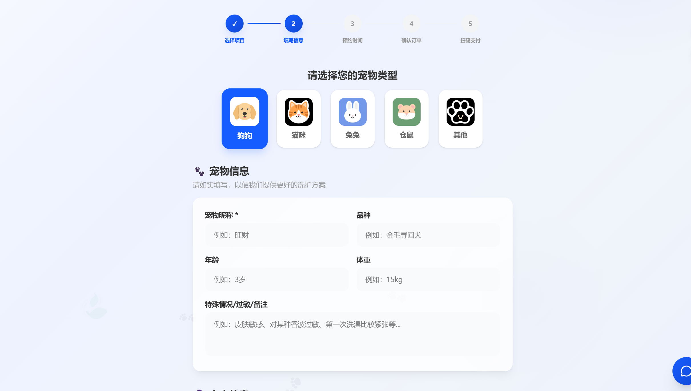
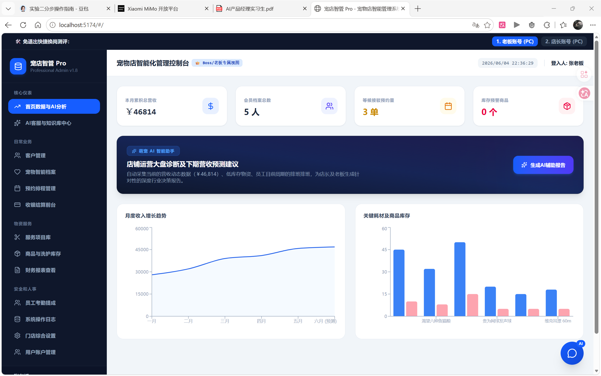

# 🐾 宠店智管 Pro — 宠物店智能管理系统

<div align="center">

**AI 赋能 · 让宠物店经营更轻松**

[](https://www.python.org/)
[](https://fastapi.tiangolo.com/)
[](https://react.dev/)
[](https://www.typescriptlang.org/)
[](https://tailwindcss.com/)
[](https://www.postgresql.org/)
[](LICENSE)

</div>

---
 
## 📖 项目简介

**宠店智管 Pro** 是一个面向宠物店的全栈智能管理系统，集成了 AI 智能助手、在线预约、会员管理、库存管理、收银结算等功能。系统采用前后端分离架构，支持 PC 管理后台、顾客在线预约、员工/顾客移动端等多端场景。

### 核心亮点

- 🤖 **AI 智能助手** — 基于 AI 的经营分析、宠物健康咨询、洗护推荐
- 📅 **在线预约系统** — 5 步流程：选项目 → 填信息 → 选时间 → 确认 → 支付
- 🎫 **会员体系** — 普通会员 / 黄金卡 / 钻石卡，阶梯折扣
- 📊 **数据化经营** — 仪表盘、营收分析、客户画像、AI 经营建议
- 📱 **多端适配** — PC 管理后台 + 顾客预约页 + 微信小程序风格移动端

---

## 🖥️ 系统预览

<div align="center">

</div>

<div align="center">

</div>

<div align="center">

</div>
---

## 🏗️ 技术架构

```
pet_manage/
├── row/                          # 主项目目录
│   ├── backend/                  # Python FastAPI 后端
│   │   ├── app/
│   │   │   ├── main.py           # 应用入口
│   │   │   ├── config.py         # 配置管理
│   │   │   ├── database.py       # 数据库模型 (SQLAlchemy)
│   │   │   ├── gemini.py         # Gemini AI 集成
│   │   │   └── routes/           # API 路由
│   │   │       ├── appointments.py   # 预约管理
│   │   │       ├── clients.py        # 客户/会员
│   │   │       ├── pets.py           # 宠物档案
│   │   │       ├── services.py       # 服务项目
│   │   │       ├── inventory.py      # 库存管理
│   │   │       ├── employees.py      # 员工管理
│   │   │       ├── users.py          # 用户认证
│   │   │       ├── chat.py           # AI 经营分析
│   │   │       └── kb.py             # 知识库
│   │   └── requirements.txt
│   ├── src/                      # React + TypeScript 前端
│   │   ├── components/
│   │   │   ├── LandingPage.tsx       # 沉浸式落地页
│   │   │   ├── LoginLayout.tsx       # 登录模态框
│   │   │   ├── AdminWorkspace.tsx    # PC 管理后台
│   │   │   ├── CustomerBooking.tsx   # 顾客在线预约
│   │   │   ├── CustomerMobile.tsx    # 顾客移动端
│   │   │   ├── GroomerMobile.tsx     # 员工移动端
│   │   │   └── MiniAppLogin.tsx      # 小程序登录
│   │   ├── hooks/useApiData.ts       # API 数据 Hooks
│   │   ├── App.tsx                   # 路由与全局状态
│   │   ├── types.ts                  # TypeScript 类型
│   │   └── data.ts                   # 初始模拟数据
│   ├── public/                   # 静态资源
│   │   └── slides/               # 落地页轮播图
│   ├── package.json
│   └── vite.config.ts
├── lbt/                          # 轮播图素材
├── example/                      # 参考页面
└── erweima/                      # 支付二维码
```

---

## 🚀 快速开始

### 环境要求

| 依赖 | 版本 |
|------|------|
| Python | >= 3.11 |
| Node.js | >= 18.0 |
| PostgreSQL | >= 14.0 |

### 1. 克隆项目

```bash
git clone https://github.com/SSA-AFK/pet_system.git
cd pet_system/row
```

### 2. 配置数据库

```sql
CREATE DATABASE pet_manage;
```

### 3. 配置环境变量

```bash
cp .env.example .env
```

编辑 `.env`：

```env
DATABASE_HOST=localhost
DATABASE_PORT=5432
DATABASE_NAME=pet_manage
DATABASE_USER=postgres
DATABASE_PASSWORD=your_password

# Gemini AI（可选，不配置则使用模拟数据）
GEMINI_API_KEY=your_api_key
```

### 4. 启动后端

```bash
cd backend
python -m venv venv

# Windows
.\venv\Scripts\activate
# macOS/Linux
source venv/bin/activate

pip install -r requirements.txt
uvicorn app.main:app --reload --port 8000
```

后端启动于 http://localhost:8000 ，API 文档：http://localhost:8000/docs

### 5. 启动前端

```bash
cd ..
npm install
npm run dev
```

前端启动于 http://localhost:5173

---

## 🎯 功能模块

### 🏠 沉浸式落地页
- 全屏轮播背景（支持自定义图片）
- 深灰导航栏 + 蓝白专业主题
- AI 智能助手浮窗
- 门店信息展示（地址、电话、营业时间）

### 📅 顾客在线预约 (`#/book`)
- 5 步流程：选择项目 → 填写信息 → 选择时间 → 确认订单 → 扫码支付
- 服务多选 + 商品选购
- 会员自动折扣（普通 95 折 / 黄金 9 折 / 钻石 8 折）
- 注册/登录一体化
- 库存实时校验，库存不足自动禁选

### 👑 管理后台 (`#/`)
- **仪表盘** — 今日营收、预约数、会员数、库存预警
- **AI 智能助手** — 经营分析、营收预测、客户画像
- **客户管理** — 客户档案、会员等级、消费记录
- **宠物档案** — 宠物信息 CRUD，绑定主人
- **预约管理** — 预约列表、状态流转、排班
- **服务管理** — 服务项目配置、价格管理
- **库存管理** — 商品入库、库存预警、出入库记录
- **收银结算** — 快速开单、会员扣费
- **员工管理** — 员工档案、排班、绩效
- **系统设置** — 角色权限、操作日志

### 📱 移动端
- **员工面板** — 工单查看、服务记录、AI 洗护建议
- **顾客面板** — 预约记录、会员卡、AI 健康咨询

---

## 🤖 AI 功能

| 功能 | 说明 |
|------|------|
| 经营分析 | 基于销售数据的 AI 深度分析与优化建议 |
| 宠物健康咨询 | AI 辅助的宠物健康问诊 |
| 洗护推荐 | 根据宠物特征的个性化洗护方案 |
| 智能客服 | 基于知识库的多角色 AI 问答 |

> 💡 未配置 Gemini API Key 时，系统自动使用模拟数据，不影响其他功能。

---

## 📡 API 接口

| 接口 | 方法 | 说明 |
|------|------|------|
| `/api/services` | GET/POST | 服务项目 |
| `/api/clients` | GET/POST | 客户管理 |
| `/api/clients/register` | POST | 客户注册 |
| `/api/clients/login` | POST | 客户登录 |
| `/api/pets` | GET/POST | 宠物档案 |
| `/api/appointments` | GET/POST | 预约管理 |
| `/api/inventory` | GET/POST | 库存管理 |
| `/api/employees` | GET/POST | 员工管理 |
| `/api/users/login` | POST | 管理员登录 |
| `/api/gemini/chat` | POST | AI 智能对话 |
| `/api/gemini/analyze-business` | POST | AI 经营分析 |
| `/api/gemini/pet-health` | POST | AI 宠物健康 |
| `/api/gemini/suggest-grooming` | POST | AI 洗护推荐 |

---

## 🎨 设计规范

| 元素 | 值 |
|------|-----|
| 主色 | `#165DFF` |
| 辅助色 | `#FF7D00` |
| 导航栏 | `#1F2329` |
| 字体 | 系统默认无衬线字体 |
| 圆角 | 4px - 16px |
| 动画 | 0.3s - 0.5s 过渡 |

---

## 🤝 贡献

1. Fork 本仓库
2. 创建特性分支：`git checkout -b feature/your-feature`
3. 提交更改：`git commit -m 'Add some feature'`
4. 推送分支：`git push origin feature/your-feature`
5. 提交 Pull Request

---

## 📄 许可证

本项目采用 [MIT License](LICENSE) 开源许可证。

---

<div align="center">

**⭐ 如果这个项目对你有帮助，请给个 Star 支持一下！**

Made with ❤️ by [SSA-AFK](https://github.com/SSA-AFK)

</div>
